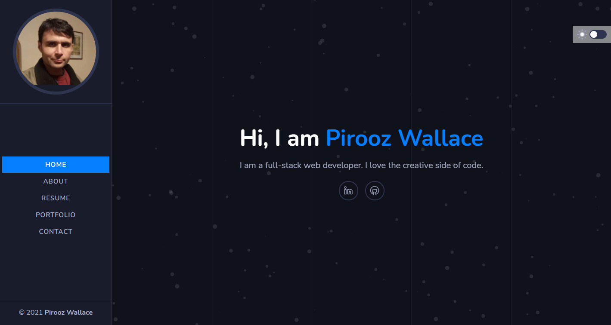
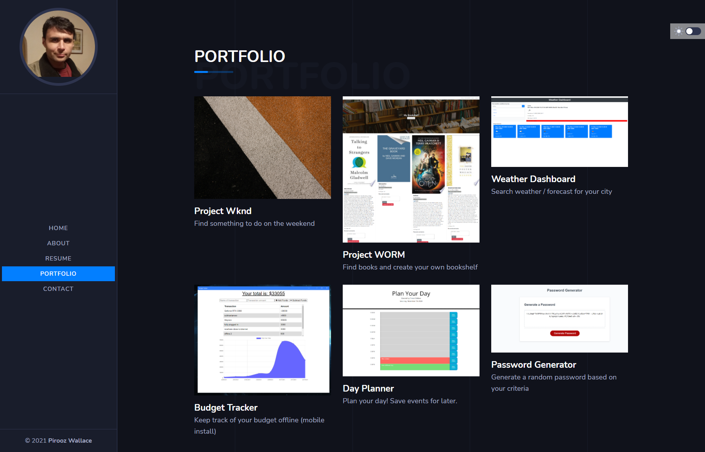
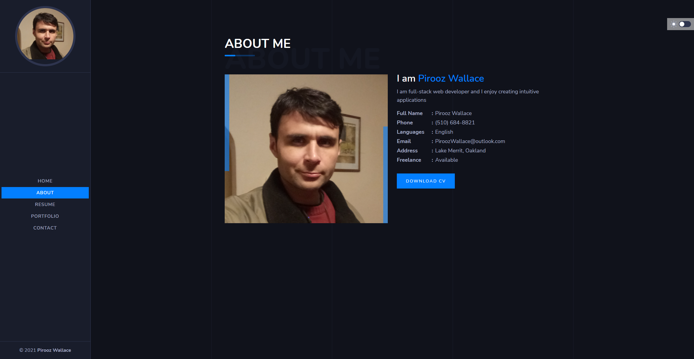

# React Portfolio

 

* [Pirooz Wallace](https://github.com/attack-theoRy)

[Deployed GitHub Pages App](https://attack-theory.github.io/react-portfolio/)

## Table of Contents
* [Description](#description)
* [User Story](#user-story)
* [Installation](#installation)
* [Tech](#tech)4
* [License](#license)
* [Questions](#Questions)
* [Credits](#Credits)

## Description

This is a portfolio of my work as well as a resume and how to contact me. I used a professional template and heavily modified it for my own purposes. There is a portfolio component that is used multiple times on the portfolio page for each project and a react router used to serve each page. There is a footer as well with the year and my name. There is a dark / light theme switch as well built-in. 

This is the front page, you can also switch from light to dark theme

This is the portfolio page, you can click on each project to zoom in or click the link to be taken to the deployed app.

To download my resume, click on about and goto download cv

## Installation

To install repo locally
` npx create-react-app ` 
` npm install ` to intall the dependencies in package.json
run `npm start ` and open a browser to http://localhost:3000

## Tech

* React
* CSS
* NodeJS
* Axios
* Bootstrap

## Questions

Email: PiroozWallace@outlook.com
 
Visit my portfolio at: https://attack-theory.github.io/Portfolio/

## License 

Licensed under the 

MIT License

Copyright (c) 2021 - Pirooz Wallace

Permission is hereby granted, free of charge, to any person obtaining a copy
of this software and associated documentation files (the "Software"), to deal
in the Software without restriction, including without limitation the rights
to use, copy, modify, merge, publish, distribute, sublicense, and/or sell
copies of the Software, and to permit persons to whom the Software is
furnished to do so, subject to the following conditions:

The above copyright notice and this permission notice shall be included in all
copies or substantial portions of the Software.

THE SOFTWARE IS PROVIDED "AS IS", WITHOUT WARRANTY OF ANY KIND, EXPRESS OR
IMPLIED, INCLUDING BUT NOT LIMITED TO THE WARRANTIES OF MERCHANTABILITY,
FITNESS FOR A PARTICULAR PURPOSE AND NONINFRINGEMENT. IN NO EVENT SHALL THE
AUTHORS OR COPYRIGHT HOLDERS BE LIABLE FOR ANY CLAIM, DAMAGES OR OTHER
LIABILITY, WHETHER IN AN ACTION OF CONTRACT, TORT OR OTHERWISE, ARISING FROM,
OUT OF OR IN CONNECTION WITH THE SOFTWARE OR THE USE OR OTHER DEALINGS IN THE
SOFTWARE.
